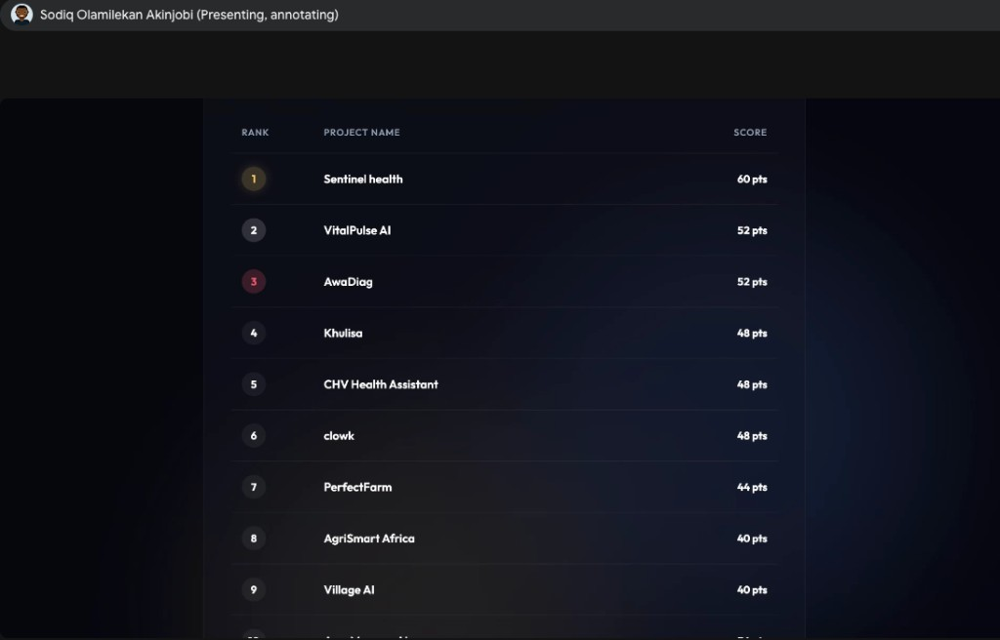

# Sentinel Health

Sentinel Health is an AI-powered field health companion for community health workers across Africa.

In many rural communities, the first person to see a sick child is not a doctor, but a Community Health Volunteer working with limited tools, poor connectivity, and high-pressure decisions. A child with malaria, pneumonia, dehydration, or severe malnutrition can deteriorate in hours. Sentinel helps that volunteer capture symptoms by voice or form, flags danger signs immediately, and uses Gemini to support triage while keeping the human firmly in control.

The same intake also becomes a public health signal. As cases sync from the field, district health officers can see live patterns, urgent referrals, and early outbreak alerts across wards.

## Buildathon Result

Sentinel Health placed first in the buildathon.



## Why This Matters

Africa’s health systems are powered by frontline workers who carry enormous responsibility with limited infrastructure. Sentinel is designed around that reality:

- Support the health worker at the edge.
- Protect the child in front of them.
- Help the district see the next outbreak before it spreads.

This is not an attempt to replace CHVs, nurses, or clinicians. It is a safety and visibility layer that helps people make faster, better-informed decisions.

## What The Demo Shows

- A modern React web app for CHV intake and district dashboards.
- Voice-assisted intake: the CHV can use browser speech recognition or on-device Whisper transcription, then Gemini extracts structured fields for human review.
- Form-based intake for low-connectivity or noisy environments.
- Deterministic danger-sign rules that bypass AI and trigger urgent referral.
- Gemini-assisted triage for non-critical cases.
- Offline-style queueing and sync to reflect field realities.
- A district dashboard showing case feed, urgent cases, and outbreak alerts.
- BigQuery-backed health event storage for downstream analytics.
- Two Cloud Run services: one frontend and one backend.

## Google Cloud Architecture

```text
Community Health Worker
        |
        v
React Frontend (Cloud Run)
        |
        v
FastAPI Backend (Cloud Run)
        |
        +-- Gemini voice-to-structured-intake
        +-- Gemini decision support for non-critical cases
        +-- Rule engine for danger signs and urgent referrals
        +-- BigQuery health event storage
        +-- Outbreak threshold detector
        |
        v
District Dashboard
```

Google products used:

- **Gemini** for transcript-to-structured-intake and triage decision support.
- **Secret Manager** for backend-only Gemini key handling.
- **Cloud Run** for independently deployed frontend and backend services.
- **BigQuery** for health events, alerts, and district analytics.
- **Cloud Build / Artifact Registry** for source-based Cloud Run deployments.
- **Cloud Logging** for deployed service observability.

## Why Gemini Now, MedGemma Next

For the buildathon, Gemini was the fastest and most accessible way to demonstrate the core workflow: voice capture, structured intake, human review, triage support, and district visibility.

Given more time, Sentinel would move toward an on-device-first architecture using MedGemma and Gemma-family models for clinically aligned triage support directly on low-cost Android devices. That future version would prioritize:

- on-device inference and transcription where connectivity is unreliable,
- local-language voice intake,
- multimodal assessment for signs such as malnutrition,
- offline sync with conflict handling,
- privacy-preserving district analytics,
- and tighter clinical validation against local protocols.

We are especially excited by the direction of newer Gemma capabilities and how MedGemma-style models can unlock multimodal, local, and privacy-preserving health workflows at the edge.

## Human-In-The-Loop Safety

Sentinel keeps the CHV in control:

- Voice input only prepopulates the form.
- The CHV reviews and edits before submission.
- Danger signs do not wait on AI.
- AI output is decision support, not diagnosis.
- District alerts are signals for public health action, not automated conclusions.

## Demo Flow

1. Open the CHV intake screen.
2. Record a spoken note using quick browser voice or on-device Whisper, then use Gemini to prefill the form.
3. Review the extracted fields as the CHV.
4. Submit a normal cough/fever case and show AI-supported triage.
5. Submit a danger-sign case and show immediate urgent referral.
6. Open the district dashboard to show live cases, urgent referrals, and outbreak alerts.
7. Trigger the demo diarrhoea cluster to show early outbreak visibility.

## Deployed Services

The app is designed as two Cloud Run services that talk to each other:

- `sentinel-frontend`: React frontend
- `sentinel-backend`: FastAPI backend

Current deployment target:

- Project ID: `oceanhub-dev`
- Project number: `744360072255`
- Region: `us-central1`

## Run Locally

Requirements:

- Python 3.12
- `uv`
- Node.js / npm

Start both services:

```bash
./run-local.sh
```

Open:

- Frontend: `http://localhost:5173`
- Backend health: `http://localhost:8000/api/v1/health`
- Backend docs: `http://localhost:8000/docs`

Optional local Gemini configuration:

```bash
cp backend/.env.example backend/.env
# add GEMINI_API_KEY to backend/.env
./run-local.sh
```

Do not place `GEMINI_API_KEY` in the frontend. The React app calls the backend, and the backend calls Gemini.

## Deploy

Store the Gemini key in Secret Manager:

```bash
./scripts/create-gemini-secret.sh
```

Deploy both Cloud Run services:

```bash
./scripts/deploy-cloud-run.sh
```

The deploy script:

- enables required Google Cloud APIs,
- grants the Cloud Run runtime service account access to the Gemini secret,
- deploys `sentinel-backend` with `GEMINI_API_KEY` mounted from Secret Manager,
- deploys `sentinel-frontend` with `BACKEND_URL` pointing to the backend,
- and enables BigQuery event persistence through the backend.

## Docker Images

Build both service images locally:

```bash
./scripts/build-images.sh
```

Run the backend image:

```bash
docker run --rm -p 8000:8080 sentinel-backend:local
```

Run the frontend image:

```bash
docker run --rm -p 8501:8080 \
  -e BACKEND_URL=http://host.docker.internal:8000 \
  sentinel-frontend:local
```

## API Highlights

- `GET /api/v1/health`
- `POST /api/v1/voice/extract`
- `POST /api/v1/triage`
- `POST /api/v1/sync`
- `GET /api/v1/dashboard`
- `GET /api/v1/cases`
- `GET /api/v1/alerts`
- `POST /api/v1/demo/outbreak`
- `GET /api/v1/bigquery/status`

## Build Process

The code was built with an AI-assisted development workflow using Antigravity-style iteration: move quickly, inspect the generated code, verify the behavior, and keep the architecture deployable. That mattered for this project because the demo needed to be more than a mockup: it needed a working frontend, backend, Gemini integration path, Secret Manager handling, BigQuery writes, and Cloud Run deployment.

## Vision

Sentinel Health is a prototype, but the direction is serious: an Africa-ready health intelligence layer that works where care actually starts, with the person closest to the patient.