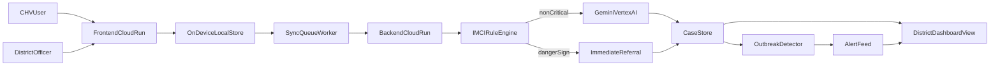

# Sentinel Health PRD v1

## 1. Document Control

- **Project:** Sentinel Health
- **Track:** AI for Health (Google Buildathon)
- **Version:** v1.0 (Demo-first)
- **Date:** April 2026
- **Status:** Ready for implementation

## 2. Problem

In rural districts, children with acute malaria or pneumonia can die within 24 hours if treatment or referral is delayed. Community Health Volunteers (CHVs) are the first point of care but face high pressure, variable diagnostic confidence, and weak escalation paths.

At the district level, outbreak signals are often delayed due to manual reporting. By the time officials detect a pattern, response is already late.

## 3. Product Vision

Sentinel Health is an AI-enabled triage and outbreak awareness system built for CHVs and district officers.

One symptom intake produces two outcomes:
- A CHV gets immediate decision support and clear next actions.
- A district officer gets near-real-time visibility and alerting for potential outbreaks.

## 4. About Sentinel Health

Sentinel Health is built from a simple belief: Africa already has a powerful first-mile health network in Community Health Volunteers, but they need better tools at the exact moment a caregiver asks for help.

The product does not try to replace clinicians, CHVs, or Ministry of Health systems. It strengthens them. A CHV captures symptoms once, receives safety-first guidance for the child in front of them, and automatically contributes to a district-level signal that can reveal an outbreak earlier than paper reporting.

This matters in rural African settings because the biggest gaps are often time, distance, and visibility. A child with pneumonia, malaria, dehydration, or severe malnutrition can deteriorate before a facility visit happens. At the same time, district officers may not see clusters until manual reports arrive days later.

Sentinel Health is designed to grow into:
- a CHV-first mobile workflow for guided intake, voice capture, and offline sync
- Gemini-supported decision support for non-critical cases, with deterministic escalation for danger signs
- computer vision support for visible malnutrition screening when image capture is appropriate
- BigQuery-powered district analytics for syndrome trends, ward burden, and alert review
- integration with DHIS2/HMIS reporting so Ministry teams can act without duplicate data entry
- a national surveillance layer that turns routine first-mile care into earlier public health intelligence

## 5. Buildathon Goal (60-Minute Demo)

Deliver a reliable, end-to-end prototype that demonstrates:
- CHV case capture and triage
- Safety-first urgent referral logic
- District dashboard with live case feed and outbreak alerts
- On-device data capture with robust sync when connectivity returns
- Deployment of frontend and backend as two Google Cloud Run services

## 6. Users

### 6.1 Primary User: CHV

- Needs fast, guided intake
- Needs confidence in next action
- Works in low-connectivity settings

### 6.2 Secondary User: District Health Officer

- Needs live district view of submitted cases
- Needs clear outbreak alert signals with thresholds
- Needs fast acknowledgment and triage of district-level risk

### 6.3 Beneficiary: Caregiver and Child

- Needs quicker escalation for danger signs
- Needs trustworthy and explainable guidance at first point of contact

## 7. Scope

### 7.1 Must Have (Demo Scope)

1. Guided symptom intake for child cases
2. IMCI danger-sign hard rules that bypass AI and trigger urgent referral
3. AI triage for non-critical cases using Gemini
4. District dashboard:
   - live case feed
   - summary KPIs
   - active outbreak alerts
5. On-device-first flow:
   - capture while offline
   - queued sync with retries
   - sync state visibility in UI
6. Dual Cloud Run deployment:
   - `frontend` service
   - `backend` service

### 7.2 Out of Scope (For This Demo)

- Production-grade EHR/HIS integration
- Multi-language interface
- Full mobile native app packaging
- Clinical-grade certification workflow
- Advanced geospatial mapping complexity

## 8. Key User Stories

### US-01: Guided CHV Intake

As a CHV, I can submit a complete child case in under 90 seconds so I can act quickly.

### US-02: Rule-First Safety

As a CHV, if any danger sign is present, I receive immediate urgent referral instructions without AI dependency.

### US-03: AI Decision Support

As a CHV, for non-critical cases, I receive a classification, urgency tier, and clear actions from Gemini-backed decision support.

### US-04: Offline Capture + Reliable Sync

As a CHV, I can capture cases on-device while offline and trust they sync automatically when connectivity is restored.

### US-05: District Dashboard

As a district officer, I can see incoming cases, key metrics, and active alerts in one view.

### US-06: Outbreak Alerting

As a district officer, I receive threshold-based outbreak alerts by syndrome and ward.

## 9. Functional Requirements

### 9.1 Triage Flow

- Capture case inputs (age, complaint, symptoms, vitals, danger signs)
- Execute danger-sign rule engine first
- If no danger signs, invoke Gemini triage
- Return structured response:
  - classification
  - urgency (`RED`, `YELLOW`, `GREEN`)
  - recommended actions
  - rationale
  - disclaimer: decision support only

### 9.2 Offline-First + Sync

- Persist unsynced cases on device
- Assign local pending ID for each draft/submission
- Sync worker behavior:
  - retries with backoff
  - idempotent submit contract
  - explicit success acknowledgment
- Conflict behavior for this phase:
  - server wins for canonical timestamps/IDs
  - client preserves local draft history for audit in session
- UI sync states:
  - Offline
  - Pending Sync (N)
  - Syncing
  - Synced
  - Sync Error (retrying)

### 9.3 Dashboard

- Visual district command view:
  - ward burden cards or heatmap
  - urgency distribution
  - syndrome/classification mix
  - outbreak threshold progress
- Case feed with latest submitted cases
- KPI cards:
  - total cases today
  - urgent (RED) cases today
  - active alerts
- Alert panel with status and acknowledgment action

### 9.4 Outbreak Detection

- Rolling window detector (POC threshold model)
- Trigger condition example:
  - N similar cases in same ward over 48h
- Alert payload includes:
  - ward
  - syndrome/classification
  - count
  - threshold
  - detected time

## 10. Google Product Strategy

This project should clearly demonstrate use of Google products across AI and deployment:

- **Gemini** (Google AI Studio and/or Vertex AI) for non-critical triage reasoning
- **Vertex AI** for model endpoint integration and production path
- **Cloud Run** for app deployment as two independent services:
  - `frontend` (UI)
  - `backend` (API, rules, triage orchestration, detection)
- **Cloud Logging** and **Error Reporting** for runtime observability during demo and iteration
- **Cloud Build** (optional but recommended) for image build and deploy automation

## 11. Architecture (Demo-Oriented)

## 12. Deployment Approach

### 12.1 Services

- **Frontend Cloud Run service**
  - Hosts CHV and district UI
  - Calls backend API over HTTPS
- **Backend Cloud Run service**
  - Exposes triage and dashboard APIs
  - Runs rule engine, Gemini invocation, and outbreak detection logic

### 12.2 Deployment Principles

- Independent service deploys for faster iteration
- Clear environment configuration per service
- Health endpoints for demo confidence
- Safe fallback mode if Gemini endpoint is unavailable

## 13. Demo Script (5 Minutes)

1. **Hook (30s):** Explain child mortality urgency and delayed outbreak visibility.
2. **CHV normal case (60s):** Submit non-critical case, show Gemini-assisted response.
3. **CHV danger-sign case (60s):** Trigger immediate referral via rule bypass.
4. **Offline moment (60s):** Capture while offline, then reconnect and show sync completion.
5. **District dashboard (60s):** Show new cases and outbreak alert panel update.
6. **Close (30s):** One intake, two outcomes, deployed on Google Cloud Run.

## 14. Success Metrics (Demo Phase)

- Intake time: under 90s
- Rule-engine response for danger-sign path: near-instant
- AI triage latency target: under 5s
- Sync recovery: queued offline case appears on dashboard after reconnect
- Alert visibility: threshold breach appears in dashboard alert panel

## 15. Risks and Mitigations

- **Connectivity instability:** Offline queue + sync retries + visible status.
- **Model/API latency:** deterministic fallback response path for demo.
- **Malformed model output:** strict schema validation and fallback action.
- **Demo-time failure:** pre-seeded data and manual alert trigger path.

## 16. Human-Centered Positioning

- CHVs are not replaced; they are supported under pressure.
- Safety-first escalation is deterministic for danger signs.
- Recommendations are decision support, not autonomous diagnosis.
- District officials gain earlier visibility to act before outbreaks grow.

## 17. README Requirement (Root)

The root `README.md` must tell the story in this order:
1. Human problem and why this matters now
2. How Sentinel helps CHVs and district officers
3. Google products used and why each one was chosen
4. Deployment model with two Cloud Run services
5. Quickstart for local run and cloud deployment
6. Demo flow and judging narrative

## 18. Immediate Next Steps

1. Implement backend rule-first triage API contract
2. Implement frontend intake and dashboard views
3. Implement offline queue + sync worker behavior
4. Wire Gemini integration and fallback mode
5. Deploy frontend and backend to Cloud Run
6. Finalize README story and runbook
